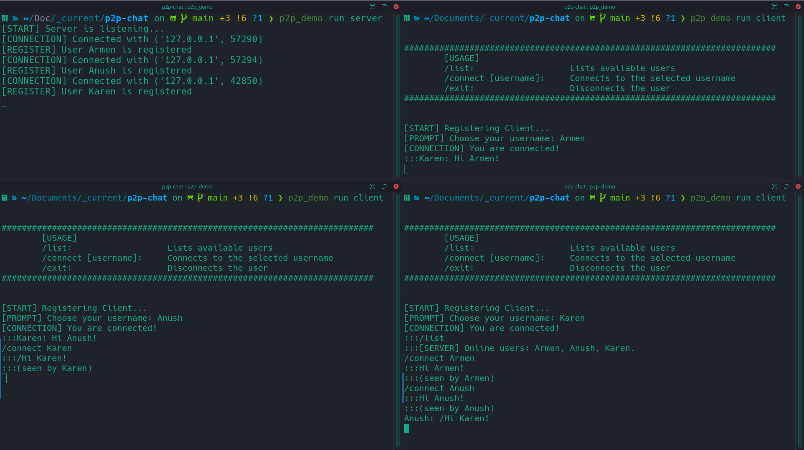

# Peer to peer console application

### Goals of the project

The clients are able to connect to the server and 
obtain a list of available clients. After obtaining this list, the client are able 
to connect to one other client on the list. The clients are capable of relaying text 
messages directly to one another.

### How to use the program?
- Run `p2p_chat/server.py`
- Run `p2p_chat/client.py`
- Follow the prompts.

### To be improved
- Exchange messages without the help of the server
- To improve the UI
- To implement a GUI
- To connect users outside the localhost

### Demo
